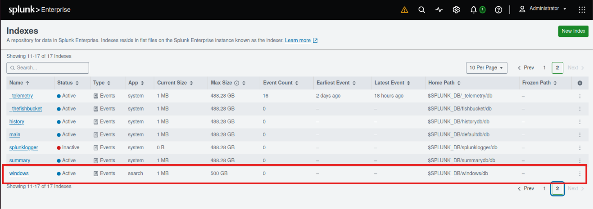
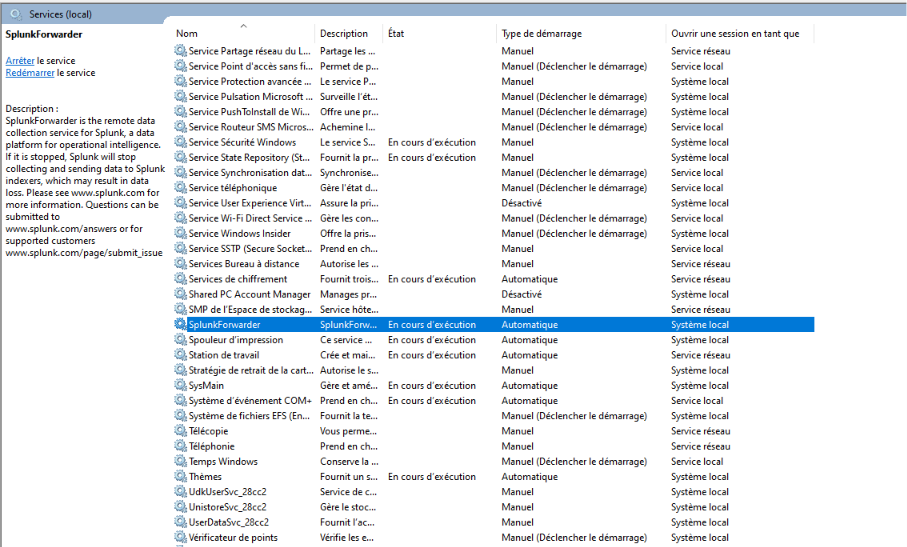
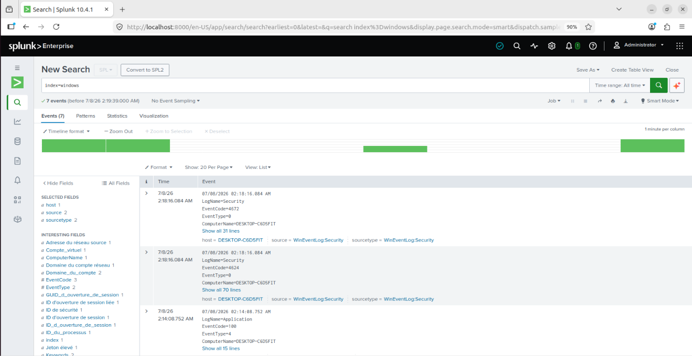

# 02 - Windows Log Monitoring

## Objective

Configure a Windows endpoint to forward Windows Event Logs to Splunk Enterprise using Splunk Universal Forwarder.

This phase confirms that Windows logs are successfully collected and indexed in Splunk under the `windows` index.

## Step 1 - Create Windows Index

A dedicated Splunk index named `windows` was created to store logs collected from the Windows endpoint.

Index created:

```text
windows
```



## Step 2 - Install Splunk Universal Forwarder

Splunk Universal Forwarder was installed on the Windows endpoint.

During installation, Windows Event Logs were selected for collection:

```text
Application Logs
Security Log
System Log
```

The forwarder was configured to send logs to the Splunk Enterprise server on TCP port `9997`.

## Step 3 - Verify Forwarder Service

After installation, the `SplunkForwarder` service was verified from Windows Services.

The service was running with automatic startup enabled.



## Step 4 - Configure Windows Event Log Inputs

The forwarder was configured to send Windows Event Logs to the `windows` index.

Configured log sources:

```text
WinEventLog://Application
WinEventLog://Security
WinEventLog://System
```

## Step 5 - Verify Logs in Splunk

Windows logs were successfully received in Splunk using the following search:

```spl
index=windows
```

The results confirmed that Security and Application logs were being forwarded from the Windows endpoint.



## Outcome

Windows log monitoring was successfully configured.

Splunk is now receiving Windows Event Logs from the endpoint, enabling future detection use cases such as failed logon monitoring, brute-force detection, and Windows security event investigation.
